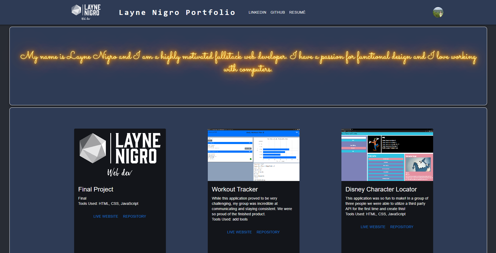

# Layne Nigro Portfolio

## Description

This is my portfolio page, created in React with the assistance of Material-ui styles. I had so much fun creating this and i cannot wait to continue adding to it and building upon what ive created.

## Table of Contents
 - [usage](#usage)
 - [credits](#credits)
 - [license](#license)
 - [questions](#questions)

## Usage

Screenshot: 

Deployed Link: (https://layneni.github.io/portfolio/)

## Credits

Contributors: 

Ananya Neogi (https://codepen.io/ananyaneogi/pen/Bgozrz)

Vikram Sansare (https://codepen.io/vikramsansare/pen/eYJPogJ)

## License
This project is licensed under the MIT license. https://choosealicense.com/licenses/mit/

## Questions

Github Username: LayneNi

Githin Profile link: https://github.com/LayneNi

For any additional questions please reach out to me via email at Laynenigro@gmail.com
